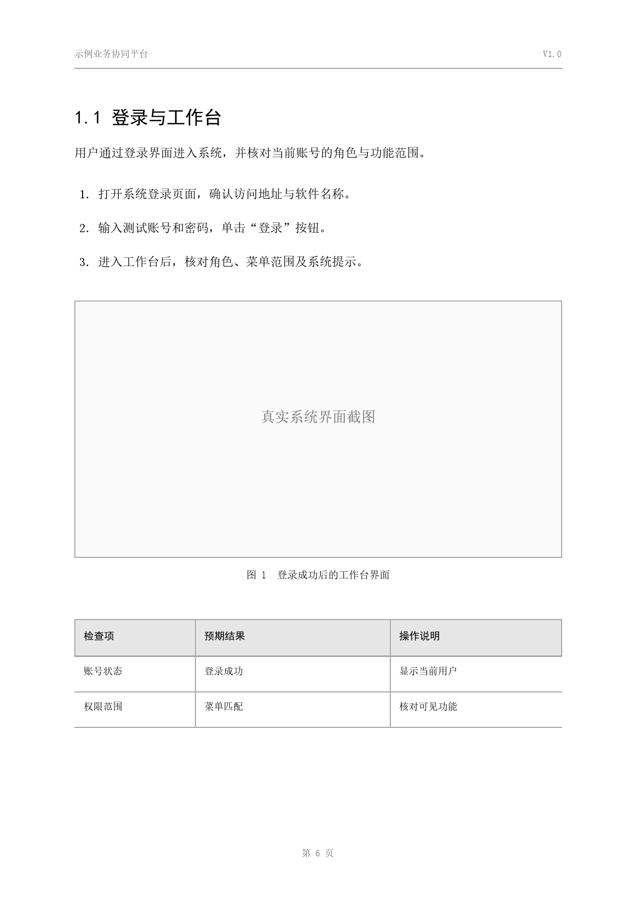
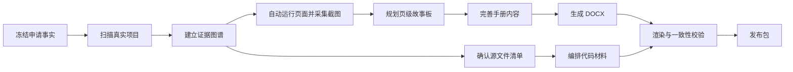

# Software Certificate Skill

> 从真实软件项目出发，生成可追溯、可审阅、可交付的中国软件著作权申请材料。


[](LICENSE)

`software-certificate-skill` 是一套面向中国计算机软件著作权登记材料的Skill。它不靠万能模板堆砌套话，而是扫描真实项目、建立证据图谱、规划操作手册、编排源程序识别材料，并在交付前检查名称、版本、功能、截图、代码与申请事实的一致性。

当前规则研究快照：**2026-08-11**。正式提交前，应按照提交当日的中国版权保护中心申请系统和官方文件刷新规则。

## 核心能力

- **真实项目取证**：扫描路由、控制器、页面、服务、模型、配置、测试和截图等项目事实。
- **自动化界面取证**：启动本地 Web 应用、自动登录、执行页面动作、批量截图，并检测空白图、重复图和尺寸异常。
- **证据驱动写作**：每项功能声明绑定真实入口、操作路径、系统反馈或代码来源。
- **约 60 页手册规划**：依据项目复杂度在 40–66 页间自动分配页面任务，内容充分时灵活扩展。
- **标准申报排版**：A4、黑白灰、宋体正文、黑体标题、浅灰表头，适合打印和正式审阅。
- **真正的 Word 目录**：使用 Word `TOC` 域、标题大纲级别和超链接，不生成静态“假目录”。
- **源程序连续编排**：按完整源文件组织代码，保留逐行来源映射，支持前后各连续 30 页的申报视图。
- **一致性校验**：核对软件名称、简称、版本、权利人、日期、功能、截图、代码页眉和待确认项。
- **可重复发布**：保留事实源、证据图谱、页级故事板、来源映射、校验报告与文件哈希。
- **多 Agent 适配**：支持 Claude Code、Cursor、OpenCode、WorkBuddy、QoderWork、TraeWork 以及通用 Agent Skills / `AGENTS.md` 工作区。

## 设计原则

| 原则 | 做法 |
|---|---|
| 真实 | 只写项目中存在且可核验的功能、页面、接口和操作结果 |
| 连续 | 代码按完整源文件组织，申报裁切保持前后页连续 |
| 克制 | 使用正式黑白灰版式，避免宣传册、渐变、彩色卡片和装饰元素 |
| 可追溯 | 文档陈述关联证据标识，代码保留文件与行号来源 |
| 可审阅 | 先生成结构化底稿，再生成 Word，最后逐页渲染检查 |
| 一致 | 所有材料从同一份申请事实文件派生 |

## 版式预览



默认版式采用：

- 手册正文：宋体 12 pt；一级、二级、三级标题为黑体 16 / 15 / 14 pt；
- 手册页边距：上 20 mm、下 20 mm、左 25 mm、右 20 mm；
- 代码正文：Courier New / 宋体 9 pt，固定 10.8 pt 行距；
- 代码页：每页 50 个真实代码行，默认最长 88 字符；
- 页眉页脚：仅保留软件名称、版本、材料类型和页码等必要信息；
- 全文：只使用黑、白和灰阶，截图保持原比例，不裁切关键界面。

测量依据见 [`references/layout-benchmarks.md`](references/layout-benchmarks.md)。

## 工作流程



```text
项目事实 → 证据图谱 → 页级故事板 → 手册正文 → DOCX/PDF 渲染 → 校验报告
项目源码 → 有序源文件清单 → 完整代码归档 → 申报视图 → 来源映射
```

## 安装

### 克隆仓库

```powershell
git clone https://github.com/IvanCodesDev/software-certificate-skill.git
cd software-certificate-skill
```

### 一次适配多个 Agent 平台

安装到目标项目：

```powershell
python scripts/install_agent_skill.py `
  --platform all `
  --scope project `
  --project E:\path\to\target-project `
  --force
```

支持的平台入口：

| 平台 | 适配入口 |
|---|---|
| Codex | `.agents/skills/` + `AGENTS.md`，或个人目录 `.codex/skills/` |
| Claude Code | `.claude/skills/software-certificate-skill/` |
| Cursor | `.cursor/skills/software-certificate-skill/` |
| OpenCode | `.opencode/skills/software-certificate-skill/` |
| WorkBuddy | `.agents/skills/` + `AGENTS.md` |
| QoderWork | `.agents/skills/` + `.qoder/rules/` |
| TraeWork | `.agents/skills/` + `.trae/rules/` |

先预览安装行为：

```powershell
python scripts/install_agent_skill.py --platform all --scope project `
  --project E:\path\to\target-project --dry-run
```

平台内可使用类似请求：

```text
使用 software-certificate-skill，基于当前项目生成软件著作权申请材料；先扫描真实项目并自动采集可复现的页面截图。
```

### 独立运行

```powershell
git clone https://github.com/IvanCodesDev/software-certificate-skill.git
cd software-certificate-skill
python -m pip install python-docx Pillow
```

推荐环境：

- Python 3.10+；
- Windows PowerShell 5.1+ 或 PowerShell 7+；
- Microsoft Word，用于刷新目录、页码和交叉引用域；
- 可将 DOCX 渲染为 PDF/PNG 的工具，用于逐页视觉检查。

需要自动化截图时安装可选依赖：

```powershell
python -m pip install -r requirements-browser.txt
python -m playwright install chromium
```

详细适配规则见 [`references/agent-platforms.md`](references/agent-platforms.md)。

## 快速开始

以下命令在 Skill 根目录执行。

### 1. 初始化申请工作区

```powershell
$ProjectRoot = "E:\path\to\your-project"
$CaseDir = "E:\path\to\copyright-case"
python scripts/init_case.py --project $ProjectRoot --case $CaseDir
```

参考 [`assets/examples/application-facts.example.json`](assets/examples/application-facts.example.json) 填写 `01-intake/application-facts.json`。软件全称、简称、版本、著作权人、完成日期、发表状态、开发方式和权利范围属于冻结事实；尚未确认的信息保留显式待确认项。

### 2. 扫描项目并建立证据图谱

```powershell
python scripts/scan_project.py `
  --project $ProjectRoot `
  --output "$CaseDir\02-evidence\evidence-graph.json"
```

扫描结果用于发现候选证据；业务含义需结合真实运行界面、测试结果和申请人确认完成复核。

### 3. 自动运行页面并采集截图

从示例建立案例级截图计划：

```powershell
Copy-Item assets/examples/screenshot-plan.example.json `
  "$CaseDir\02-evidence\screenshot-plan.json"

python scripts/capture_web_screenshots.py `
  --plan "$CaseDir\02-evidence\screenshot-plan.json" `
  --validate-only
```

核对路由、角色、稳定选择器、登录方式、隐私遮罩和截图前断言后运行：

```powershell
python scripts/capture_web_screenshots.py `
  --plan "$CaseDir\02-evidence\screenshot-plan.json" `
  --output "$CaseDir\02-evidence\screenshots" `
  --evidence-source "$CaseDir\02-evidence\evidence-graph.json" `
  --evidence-output "$CaseDir\02-evidence\evidence-graph.with-screenshots.json" `
  --fail-fast
```

每张图片会记录 SHA-256、尺寸、页面 URL、角色、功能证据、控制台异常、失败请求、视觉指标和近重复检测结果。失败动作自动保存诊断截图。详见 [`references/screenshot-automation.md`](references/screenshot-automation.md)。

### 4. 自动规划操作手册

```powershell
python scripts/plan_manual.py `
  --facts "$CaseDir\01-intake\application-facts.json" `
  --evidence "$CaseDir\02-evidence\evidence-graph.json" `
  --output "$CaseDir\03-storyboard\manual-plan.json" `
  --target-pages auto

python scripts/seed_manual.py `
  --facts "$CaseDir\01-intake\application-facts.json" `
  --plan "$CaseDir\03-storyboard\manual-plan.json" `
  --output "$CaseDir\04-content\manual.json"
```

`auto` 根据可确认功能数量规划约 40–66 页。每页承担不同的信息任务，采用“场景 → 入口 → 前置条件 → 操作 → 系统反馈 → 异常处理 → 结果核验”的任务闭环。

结合项目实际运行结果、截图和操作步骤完善 `manual.json`，结构可参考 [`assets/examples/manual-input.example.json`](assets/examples/manual-input.example.json) 与 [`assets/schemas/manual.schema.json`](assets/schemas/manual.schema.json)。

### 5. 生成操作手册 DOCX

```powershell
python scripts/build_manual.py `
  --input "$CaseDir\04-content\manual.json" `
  --theme "assets\themes\standard-filing-gray.json" `
  --output "$CaseDir\06-output\操作手册-完整成册版.docx"

powershell -ExecutionPolicy Bypass -File scripts/refresh_word_fields.ps1 `
  -Path "$CaseDir\06-output\操作手册-完整成册版.docx"
```

第二条命令调用 Word 刷新目录域和页码。发布前打开文档，确认目录项可点击跳转、标题层级正确、页码已经物化。

### 6. 编排源程序识别材料

先参考 [`assets/examples/source-manifest.example.json`](assets/examples/source-manifest.example.json) 和 [`references/source-selection.md`](references/source-selection.md) 建立清单，人工确认文件顺序、第三方依赖边界、生成代码边界与敏感信息处理方式。

```powershell
python scripts/compose_code.py `
  --project $ProjectRoot `
  --manifest "$CaseDir\05-source\source-manifest.json" `
  --facts "$CaseDir\01-intake\application-facts.json" `
  --output-dir "$CaseDir\06-output\source"
```

输出包括完整代码归档、申报 TXT、申报 DOCX、逐行 provenance JSON，以及完整版本与申报裁切之间的映射。

### 7. 校验发布包

```powershell
python scripts/verify_package.py `
  --case $CaseDir `
  --manual "$CaseDir\06-output\操作手册-完整成册版.docx" `
  --source-provenance "$CaseDir\06-output\source\source-provenance.json" `
  --screenshot-index "$CaseDir\02-evidence\screenshots\screenshot-index.json" `
  --require-screenshots `
  --report "$CaseDir\07-qa\verification.json" `
  --mode release
```

若已将 Word/PDF 渲染为逐页图片，可生成视觉指标：

```powershell
python scripts/render_metrics.py `
  --images "$CaseDir\07-qa\rendered-pages" `
  --output "$CaseDir\07-qa\render-metrics.json"
```

机器校验通过后，继续逐页检查截图清晰度、表格断页、意外空白页、页面溢出和目录跳转。

Web 项目使用 `--require-screenshots` 把自动截图纳入发布硬门禁；不包含 Web 界面的桌面端、移动端或命令行项目省略该开关，并通过对应平台的真实运行截图与人工复核记录完成证据验收。

## 项目结构

```text
software-certificate-skill/
├─ SKILL.md                         跨平台 Agent Skill 执行入口
├─ agents/openai.yaml              Skill 展示信息
├─ assets/
│  ├─ examples/                    输入示例
│  ├─ schemas/                     JSON Schema
│  ├─ theme-previews/              版式预览
│  └─ themes/                      标准申报主题
├─ references/
│  ├─ rules-2026.md                2026 规则证据快照
│  ├─ research-evidence-2026.md    调研证据与使用边界
│  ├─ evidence-model.md            证据模型
│  ├─ manual-architecture.md       手册架构
│  ├─ screenshot-automation.md     自动截图与证据采集
│  ├─ agent-platforms.md           多 Agent 平台适配
│  ├─ source-selection.md          源程序选择规范
│  ├─ visual-system.md             视觉系统
│  └─ quality-gates.md             交付门禁
└─ scripts/
   ├─ init_case.py                 初始化申请工作区
   ├─ scan_project.py              扫描项目证据
   ├─ capture_web_screenshots.py   自动运行页面并采集截图
   ├─ install_agent_skill.py       生成多平台 Skill/Rules 入口
   ├─ validate_skill.py            平台无关结构校验
   ├─ plan_manual.py               规划手册页数与章节
   ├─ seed_manual.py               生成结构化正文骨架
   ├─ build_manual.py              生成操作手册 DOCX
   ├─ compose_code.py              编排源程序材料
   ├─ render_metrics.py            统计逐页渲染指标
   ├─ verify_package.py            校验发布包
   └─ self_test.py                 端到端自测试
```

案例目录约定：

```text
CASE_DIR/
├─ 01-intake/       申请事实、声明、问题清单
├─ 02-evidence/     项目指纹、证据图谱、截图索引
├─ 03-storyboard/   页级故事板、页面预算、证据欠账
├─ 04-content/      结构化手册正文
├─ 05-source/       源文件清单、开源与保密边界
├─ 06-output/       完整成册版、申报视图、代码材料
├─ 07-qa/           渲染指标、一致性报告、人工复核记录
└─ 08-release/      最终发布包及校验和
```

## 关于“60 页”

“60 页”包含两个概念：

1. **完整操作手册的内容规模**：通常规划 40 页以上，复杂系统约 60 页，根据真实功能数量、操作闭环、异常路径和截图证据密度调整。
2. **鉴别材料的交存范围**：现行规章规定，程序和文档一般提交前、后各连续 30 页；总量不足 60 页时提交全部。

本项目不靠重复截图、重复定义、空泛优势或虚构功能凑页数。最终页数以 A4 实际渲染结果为准。

## 质量门禁

发布前至少确认：

- [ ] 软件全称、简称、版本、权利人和日期在全部材料中一致；
- [ ] 每项关键功能均有真实项目证据；
- [ ] 操作手册不存在虚构菜单、按钮、接口、角色和成功结果；
- [ ] 目录是 Word TOC 域，已刷新且可点击跳转；
- [ ] 标题层级、目录项和正文一致；
- [ ] 截图清晰、比例正确、关键控件完整；
- [ ] 自动截图计划已通过，截图前断言成立，空白图和非预期重复图已经清零；
- [ ] 代码来自申请软件自身，第三方库、生成代码、密钥和无关模块已排除；
- [ ] 程序材料按完整源文件组织，逐行来源可追溯；
- [ ] 申报视图前后页连续，裁切映射完整；
- [ ] Word/PDF 已逐页渲染，无溢出、截断、异常空白页和表格断裂；
- [ ] 所有 `【待申请人确认：…】` 槽位已经清零或完成书面确认；
- [ ] 申请人已按真实开发与材料形成过程复核申请表声明。

完整门禁见 [`references/quality-gates.md`](references/quality-gates.md)。

## 规则与研究边界

信息来源分为三层：

- **A 级**：国家版权局规章、官方系统、中国版权保护中心正式通知；
- **B 级**：当年高校、地方版权或软件行业组织发布的办理流程；
- **C 级**：公开案例、代理文章和历史手册，只用于观察版式和常见差错。

详见 [`references/rules-2026.md`](references/rules-2026.md) 和 [`references/research-evidence-2026.md`](references/research-evidence-2026.md)。

本项目提供材料工程、排版和一致性校验能力；登记结果取决于项目权属、材料真实性、申请事实以及受理机构的最终审查。“固定模板保证通过”不作为本项目的设计依据。

## 自测试

```powershell
$WorkDir = Join-Path $env:TEMP "software-certificate-skill-self-test"
python scripts/self_test.py --workdir $WorkDir
```

校验 Skill 元数据：

```powershell
python scripts/validate_skill.py .
```

## 参与贡献

欢迎提交 Issue 和 Pull Request，尤其是：

- 可公开核验的官方规则更新；
- 不同技术栈的项目证据识别；
- DOCX 目录、分页和跨平台渲染兼容性；
- Playwright 登录、路由发现、页面状态等待和截图质量检测；
- Claude Code、Cursor、OpenCode、WorkBuddy、QoderWork、TraeWork 的适配回归；
- 源程序行密度与连续性校验；
- 真实项目中的误报、漏报和排版回归样例。

贡献规则资料时，请附原始 URL、发布主体、发布日期、查询日期和证据等级；贡献案例时，请先移除身份信息、密钥、商业秘密和未授权代码。

## 开源许可

本项目采用 [MIT License](LICENSE)，允许使用、复制、修改、合并、发布、分发、再许可和销售副本，但必须在副本或重要部分中保留版权声明与许可声明。

提交代码、规则资料或案例前，请阅读 [`CONTRIBUTING.md`](CONTRIBUTING.md)。第三方代码、字体、截图和示例材料仍遵循各自的许可证与授权条件。

## 致谢

感谢版权主管部门、公开办理机构与社区贡献者提供的可核验资料。本项目只提炼规则、工程流程和版式规律，不复制公开案例中的业务文字、截图或项目数据。
