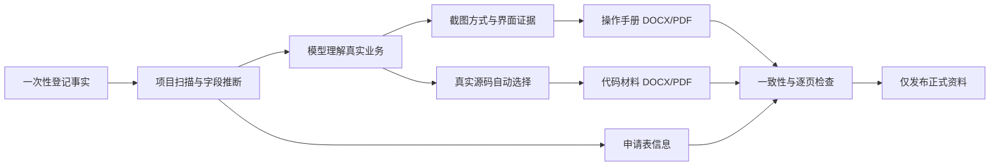

# Software Certificate Skill

> 面向普通用户，从真实项目自动生成可追溯、可编辑、可检查的软件著作权申请资料。


[](LICENSE)
[](.github/CONTRIBUTING.md)

`software-certificate-skill` 把软著材料制作变成一条证据驱动的自动化流水线。用户只需打开真实项目，说“为当前项目生成软件著作权申请资料”，集中提供一次登记事实并选择截图方式，Agent 会继续完成项目分析、业务理解、源码选择、界面取证、申请表、操作手册、代码材料、DOCX/PDF、渲染检查、修复和打包。中间文件只进入系统临时运行区，项目中只留下正式材料。

## 为什么更适合实际项目

- **不是套话生成器**：功能结论关联路由、页面、服务、测试、运行结果或截图。
- **一次收集必要信息**：名称、版本、权属、日期等集中确认；技术与业务字段自动推断。
- **自动源码筛选**：按业务相关性选取完整源文件，排除依赖、构建物、示例、重复和敏感内容。
- **四种截图方式**：Chrome DevTools、Computer Use、用户自行截图、暂时跳过。
- **真实 Word 与 PDF**：DOCX 含可点击 TOC 域；PDF 由办公套件真实转换并逐页检查。
- **正常软著排版**：A4、黑白灰、宋体正文、微软雅黑标题、浅灰表头，不做宣传册式设计。
- **干净交付目录**：证据、截图副本、渲染图、报告、哈希和备份留在系统临时运行区，项目最终只有 `正式资料/`。
- **40–60页优选、内容驱动**：常规业务系统尽量接近60页，小型项目按真实内容缩短，不靠重复结构凑页。
- **代码分卷符合规则逻辑**：达到60页生成前30页和后30页；不足60页生成全部。
- **单一事实源**：表单、手册、代码页眉、文件名和报告从一份确认事实派生。
- **断点续作与回滚**：阶段状态、输入哈希、历史快照、局部重建和最近版本恢复。
- **多 Agent 平台**：Codex、Claude Code、Cursor、OpenCode、WorkBuddy、QoderWork、TraeWork 与通用 Agent Skills / `AGENTS.md`。

## 用户最终得到什么

```text
正式资料/
├─ 申请表信息.txt                    # 复制到登记系统
├─ <软件全称>_操作手册.docx          # Word/WPS复核编辑
├─ <软件全称>_操作手册.pdf           # 按系统要求上传
├─ <软件全称>-代码(前30页).docx/.pdf # 源码达到60页时生成
├─ <软件全称>-代码(后30页).docx/.pdf # 源码达到60页时生成
└─ <软件全称>-代码(全部).docx/.pdf   # 源码不足60页时改为生成此项
```

达到60页时交付前、后30页两卷；不足60页时只交付“代码(全部)”一卷。`申请表信息.txt` 用于复制填写，PDF 用于按登记系统当日要求上传，DOCX 用于 Word/WPS 检查和编辑。校验报告、代码来源、截图索引、哈希、证据图谱、转换诊断与回滚状态由 Agent 内部维护，不进入正式交付目录，也不在最终回复中增加用户负担。

## 最简单的使用方式

在已安装此 Skill 的 Agent 中打开项目，输入：

```text
为当前项目生成软件著作权申请资料。
```

Agent 会：

1. 说明会生成哪些文件以及用途；
2. 检查环境并分析项目；
3. 用一张表集中收集必要登记事实；
4. 自动理解业务与推断其他字段；
5. 推荐截图方式并让用户选择一次；
6. 自动完成材料生成、真实 PDF 转换、逐页检查、修复和打包；
7. 最终只告诉用户正式资料位置、上传文件、复制内容、待确认问题和提交顺序。

默认隐藏脚本、JSON、置信度和技术日志。高级用户可以要求查看证据图谱、来源映射、内部报告或参数。

## 安装

```powershell
git clone https://github.com/IvanCodesDev/software-certificate-skill.git
cd software-certificate-skill
python scripts/install_agent_skill.py --platform all --scope project --project E:\path\to\project --force
```

支持入口：

| 平台 | 入口 |
|---|---|
| Codex | `.agents/skills/`、`AGENTS.md` 或个人 Skill 目录 |
| Claude Code | `.claude/skills/software-certificate-skill/` |
| Cursor | `.cursor/skills/software-certificate-skill/` |
| OpenCode | `.opencode/skills/software-certificate-skill/` |
| WorkBuddy | `.agents/skills/` + `AGENTS.md` |
| QoderWork | `.agents/skills/` + `.qoder/rules/` |
| TraeWork | `.agents/skills/` + `.trae/rules/` |

预览安装而不写入：

```powershell
python scripts/install_agent_skill.py --platform all --scope project --project E:\path\to\project --dry-run
```

## 独立运行与高级模式

基础依赖：

```powershell
python -m pip install -r requirements.txt
```

Web 自动截图：

```powershell
python -m pip install "playwright>=1.49,<2"
python -m playwright install chromium
```

准备项目并生成集中表单、截图选择卡和内部分析任务：

```powershell
python scripts/product_workflow.py prepare --project E:\path\to\project
```

Agent 完成一次性表单与内部业务理解后继续：

```powershell
python scripts/product_workflow.py resume --project E:\path\to\project
```

查看阶段状态或回滚最近正式版本：

```powershell
python scripts/product_workflow.py status --project E:\path\to\project
python scripts/product_workflow.py rollback --project E:\path\to\project
```

PDF 生成要求安装 LibreOffice 或 Microsoft Word；程序优先尝试 LibreOffice。每份文档默认180秒总转换时限，并隔离办公进程、清理失败进程树、保存诊断日志。逐页渲染需要 Poppler 的 `pdftoppm` 或 `pdftocairo`。

## 工作原理



### 真实项目取证

扫描器读取 README、配置、路由、页面、组件、控制器、服务、API、模型、状态、测试、部署与既有截图。候选关键词只负责引导进一步阅读；正式功能必须有证据或真实运行确认。

### 自动截图

Web 路线支持服务健康检查、登录、点击、输入、选择、滚动、等待、控件/文本断言、控制台与网络错误记录、失败图、进程树清理和证据图谱回写，并由真实浏览器 E2E 覆盖。Computer Use 路线用会话收据校验启动、登录、动作、图片、哈希和映射；用户截图路线按计划 ID 排序并检查近重复、清晰度和章节匹配。

### 源码材料

代码按完整源文件形成连续语料库。长行在显示层可追溯换行，每一材料行都保留原文件、原始行号、分段序号和文件哈希。每逻辑页至少50行并显式分页，PDF实际页数必须与分卷预期一致。

### 操作手册

功能章节按查询、审批、分析、监控、配置、文件处理、数据录入等类型自适应选择页面数量、标题、表格、说明和异常结构，不再机械复制同一五段式。复杂功能可拆分状态、指标、字段或异常复核，小型功能保持紧凑。目录是 Word TOC 域，不是静态文字。内容充分的常规项目优先40–60页并接近60页，小型项目按证据量缩短。

### 一致性与发布

发布门禁覆盖文件完整性、DOCX结构、PDF渲染、名称版本、外置申请字段规则、源码追溯、敏感信息、分卷连续性、业务证据、截图状态与映射、手册厚度与重复度、占位符和哈希。截图为空、等待中或失败时仅在系统临时运行区保留草稿；只有 `captured` 且全部门禁通过才进入“正式资料”。

## 规则来源

规则分为四级来源：

1. 国家版权局规章；
2. 中国版权保护中心与当前登记系统；
3. 政府、高校和行业机构办理说明；
4. 公开案例与历史经验。

每条记录保存来源、发布日期、抓取日期、适用范围和可信等级。经验建议不写成统一法定要求。详细快照见 [`references/rules-2026.md`](references/rules-2026.md) 与 [`assets/rules/rules-snapshot.json`](assets/rules/rules-snapshot.json)。

## 测试

仓库不提交大体积演示成品。端到端测试会在系统临时目录动态创建最小项目，生成申请表、操作手册、代码材料、校验报告和正式资料，测试结束后自动清理。

```powershell
python -m unittest discover -s tests -v
python scripts/validate_skill.py
python scripts/self_test.py --workdir "${TEMP}/software-certificate-self-test"
```

CI 覆盖 Windows、macOS、Linux 与 Python 3.10/3.12 的 UTF-8、结构、Schema 和单元测试；LibreOffice 任务真实验证完整产品流程及60页以上源码前后30页分卷；浏览器任务真实验证启动、登录、操作、截图、索引和证据图谱写回，不依赖仓库内置 Demo。

## 贡献与开源规则

本项目使用 [MIT License](LICENSE)。提交 Issue 或 PR 前请阅读 [贡献指南](.github/CONTRIBUTING.md)。核心要求：不得提交真实证件、账号、密钥、未授权源码或可识别申请材料；测试夹具必须脱敏；新增规则必须标注来源等级和日期；新增模板不得牺牲真实证据、可追溯性和跨平台兼容。

## 免责声明

本项目用于材料整理、排版和质量检查，不替代申请人对权属、原创性、事实真实性和登记系统当日要求的核验。最终提交前请逐项核对登记事实与声明。
